<div align="center">

<a href="https://shotcandy.app">
  <picture>
    <source media="(prefers-color-scheme: dark)" srcset="brand/logo-dark-bg.svg">
    
  </picture>
</a>

# Shotcandy

**A free, open-source screenshot beautifier and mockup maker that runs in your browser.**

Shotcandy turns a plain screenshot or screen recording into a share-ready image or video in seconds.<br>
Style one screenshot or a hundred, or put several in one mockup. No account, no upload, no watermark.

<p>
  <a href="https://shotcandy.app"><b>Open the editor</b></a> ·
  <a href="https://shotcandy.app/batch-screenshot-editor/">Batch</a> ·
  <a href="https://shotcandy.app/screenshot-mockup/">Multi-screen</a> ·
  <a href="https://shotcandy.app/code-screenshot/">Code images</a> ·
  <a href="https://shotcandy.app/app-store-screenshots/">App Store sets</a>
</p>

<p>
  <a href="https://shotcandy.app"></a>
</p>

<p>
  <a href="LICENSE"></a>
  
  
  
</p>

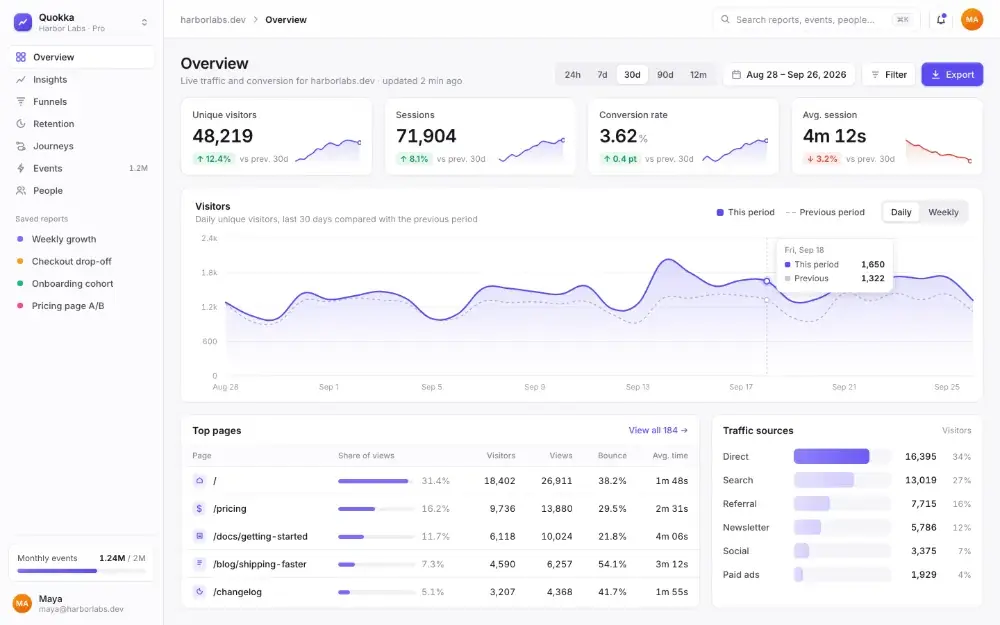

</div>

---

## Before and after

Every "after" below is a real export from Shotcandy's engine, one click from the plain screenshot on the left.

<picture>
  <source media="(prefers-color-scheme: dark)" srcset="docs/media/before-after-dashboard-dark.webp">
  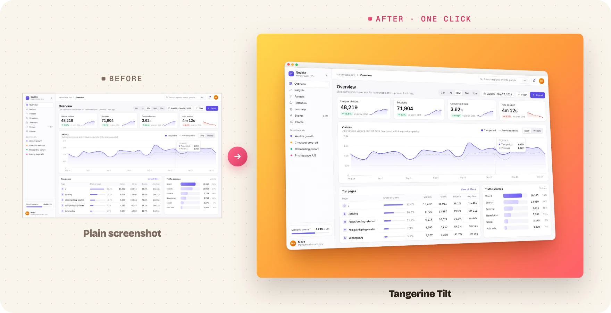
</picture>

<picture>
  <source media="(prefers-color-scheme: dark)" srcset="docs/media/before-after-editor-dark.webp">
  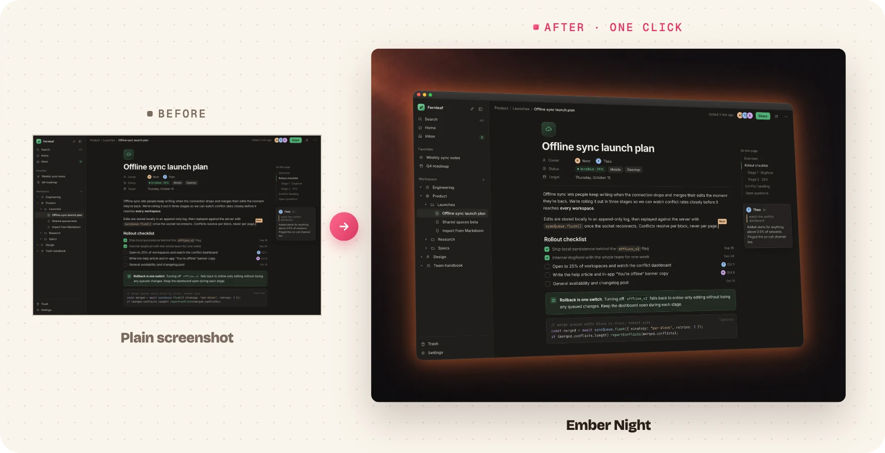
</picture>

<picture>
  <source media="(prefers-color-scheme: dark)" srcset="docs/media/before-after-phone-dark.webp">
  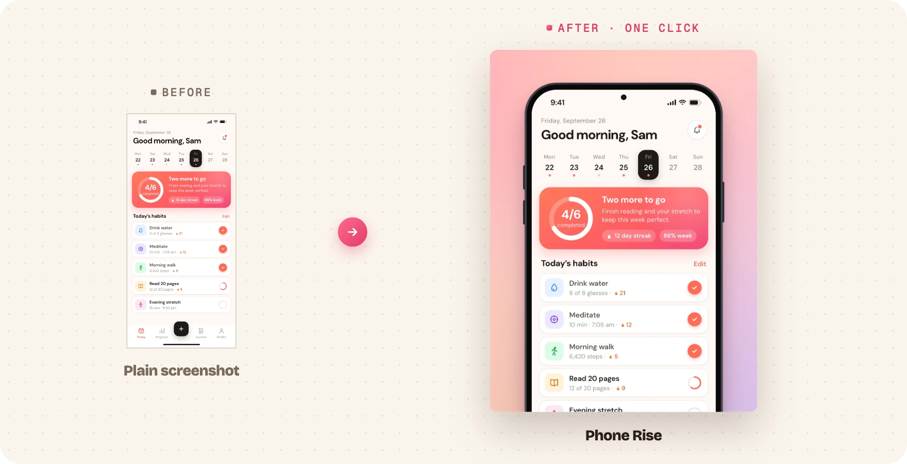
</picture>

## Why Shotcandy

- **Instant.** Press <kbd>⌘</kbd> <kbd>V</kbd>. Your screenshot lands already styled, and every style thumbnail previews *your* image, not a sample.
- **Private.** Nothing leaves your browser. There is no server to upload to.
- **Free, for real.** No account, no paywall, no locked styles, no watermark. MIT licensed.
- **Made for sharing.** Exports are sized and compressed for the place you are posting, and they can move.

It's a free, no-upload alternative to Xnapper, Pika, Shots.so and Carbon that works on any system with a browser. There's an honest comparison at [shotcandy.app/alternatives](https://shotcandy.app/alternatives/).

## Features

### Styles

42 one-click styles in eight families (from your shot, fruity, pastel, paper, minimal, deep, wallpaper and device). The Minimal family keeps it quiet: plain white, soft grey, outline, graphite and a design-canvas look. Hover to preview, press <kbd>G</kbd> for the whole Candy Jar, or press <kbd>S</kbd> for Candy Shuffle, which re-rolls background, tilt and frame together. Styles that suit your screenshot come first, and "From your shot" builds a palette from the image itself. Save your own tweaks as presets.

<picture>
  <source media="(prefers-color-scheme: dark)" srcset="docs/screenshots/gallery-dark.webp">
  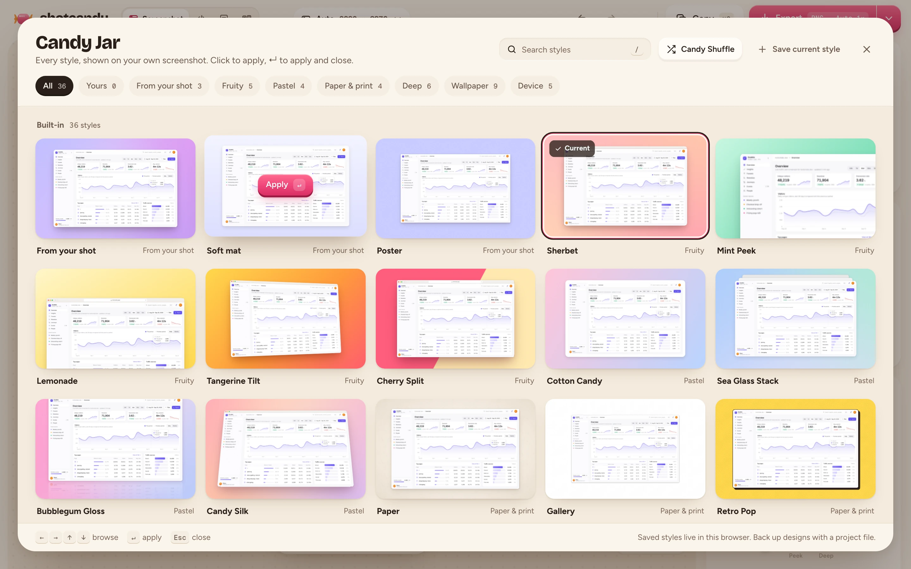
</picture>

Backgrounds cover solid colours, linear, radial and mesh gradients with an editor, 12 original wallpapers and your own images. Layout controls have named stops for padding, corners and shadow, plus borders, an inset plate, 3D tilt and position.

### Many screenshots at once

Drop, paste or add several screenshots, or a whole folder, and style them together: up to 100 on a computer, 30 on a phone. They share one style, and the All / This image switch lets you change one image without touching the rest. Export them all as a ZIP, straight into a folder in Chrome or Edge on a computer, or to the share sheet on a phone. Every file keeps its original name. Batches work in Screenshot mode.

<picture>
  <source media="(prefers-color-scheme: dark)" srcset="docs/media/feature-batch-dark.webp">
  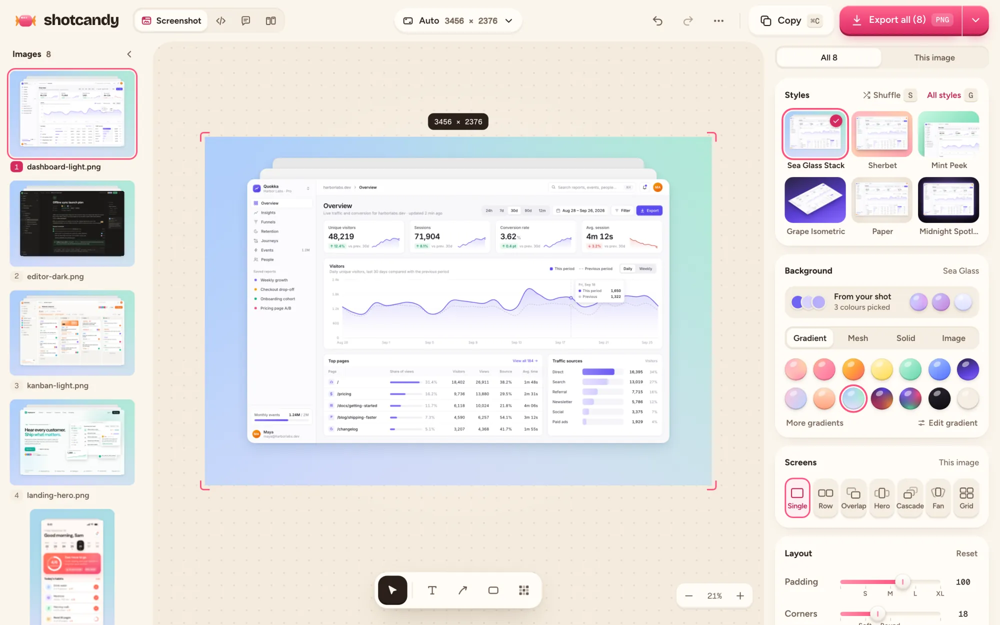
</picture>

### Multi-screen designs

Put 2 to 6 screenshots in one design with six layouts: Side by side, Overlap, Hero, Cascade, Fan and Grid. Every style works with them. In a batch, select 2 to 6 images and choose Combine into one design. Screen recordings, code and post cards stay single.

<picture>
  <source media="(prefers-color-scheme: dark)" srcset="docs/media/feature-screens-dark.webp">
  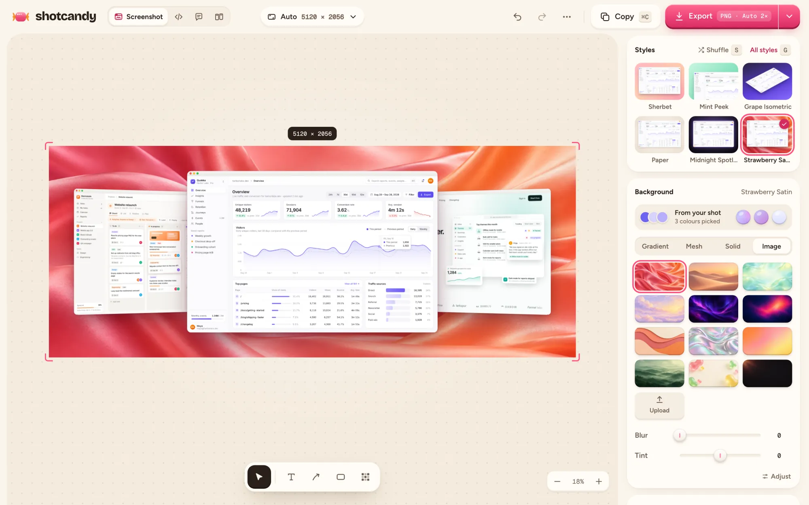
</picture>

### Caption card

Turn a landscape screenshot into a tall post in one step. Pick a 9:16 story, a 4:5 portrait or any tall size and Shotcandy adds a headline and subhead above your screenshot, set in the brand's display type with ink or white picked to suit the background. Click the text on the canvas to edit it in place.

<picture>
  <source media="(prefers-color-scheme: dark)" srcset="docs/screenshots/editor-caption-dark.webp">
  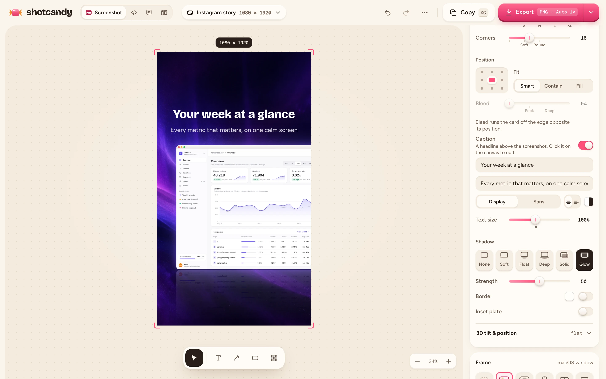
</picture>

### Frames

A macOS window, a browser (light or dark), drawn phone, tablet and laptop frames, and a design canvas frame that shows your shot the way a design tool shows a selected frame: its name above, blue selection handles, and its pixel size below. All vector, all drawn by us, no vendor artwork.

<picture>
  <source media="(prefers-color-scheme: dark)" srcset="docs/media/feature-frames-dark.webp">
  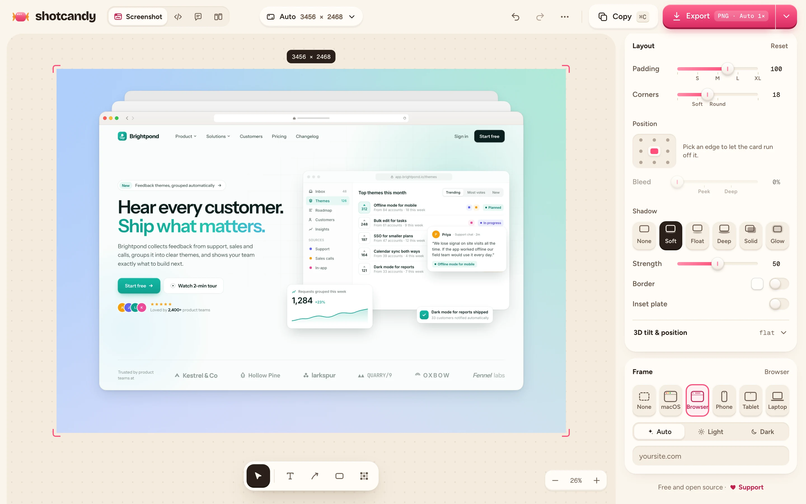
</picture>

### Annotations

Text, arrows (straight or curved), highlight boxes, and blur, pixelate or a solid box for anything private. Annotations can stick to the screenshot or to the canvas, and every one is editable after the fact.

<picture>
  <source media="(prefers-color-scheme: dark)" srcset="docs/screenshots/editor-annotate-dark.webp">
  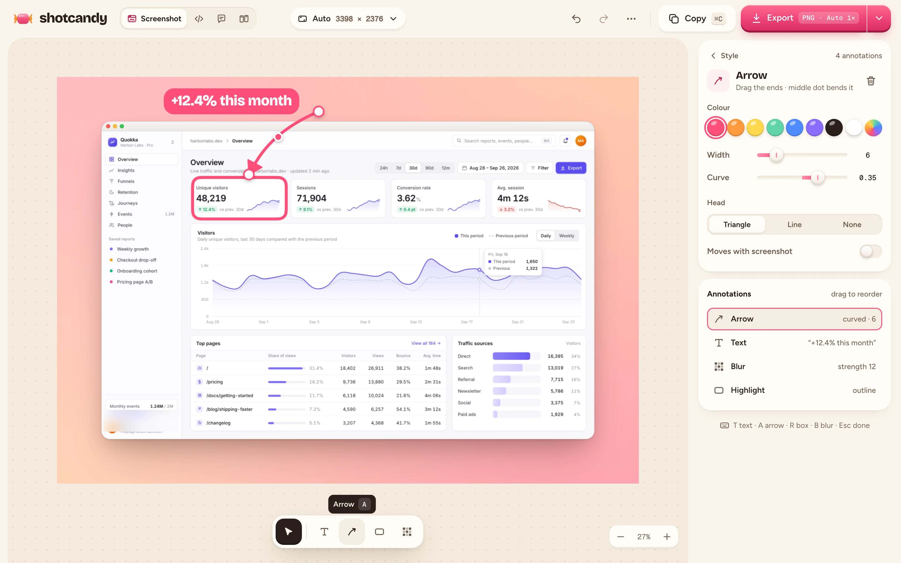
</picture>

### Motion

Eight motion presets (zoom in, focus, scroll, 3D sweep, float, drift, draw on, flip in) that loop seamlessly. Export MP4, WebM or GIF at up to 4K, rendered frame by frame by the same engine that draws your stills.

<table>
  <tr>
    <td width="50%">
      <picture>
        <source media="(prefers-color-scheme: dark)" srcset="docs/screenshots/editor-motion-dark.webp">
        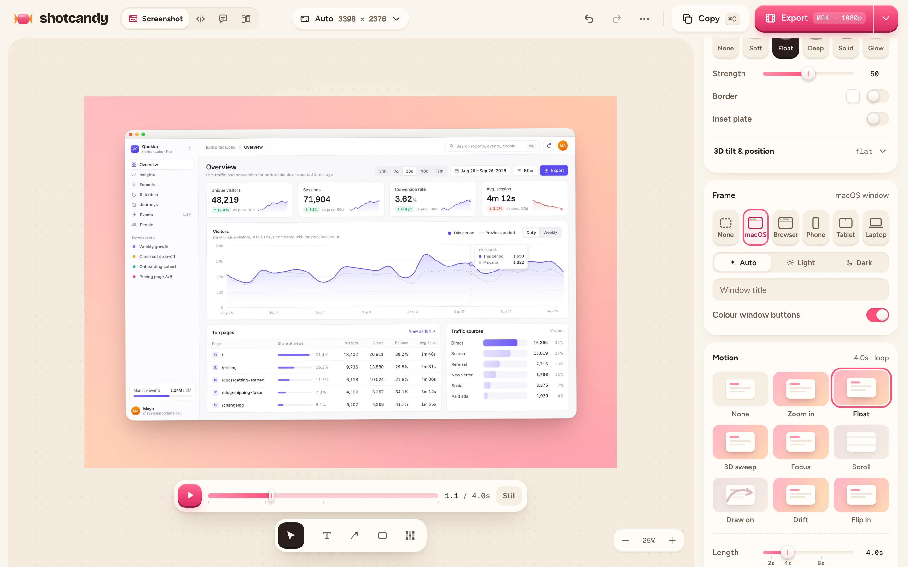
      </picture>
    </td>
    <td width="50%">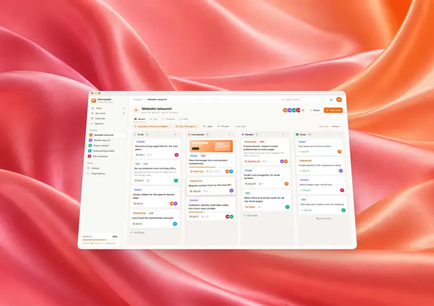</td>
  </tr>
</table>

### Screen recordings

Drop in an MP4, MOV or WebM screen recording and it gets the same treatment as a screenshot: background, frame, tilt, shadow, caption and blur boxes. Trim it, keep or drop the sound, add a motion on top, and export MP4, WebM or GIF. Everything happens in your browser, and the recording is never uploaded. Recordings up to 10 minutes and 1 GB open. Your browser must be able to play the recording: HEVC files open in Safari, or you can re-save them as H.264.

### Code images

Paste code, pick one of 8 themes with a matching background, highlight lines and set a filename. Syntax highlighting by Shiki across 26 languages, with auto-detect. Add a motion to export it as MP4 or GIF.

<picture>
  <source media="(prefers-color-scheme: dark)" srcset="docs/screenshots/editor-code-dark.webp">
  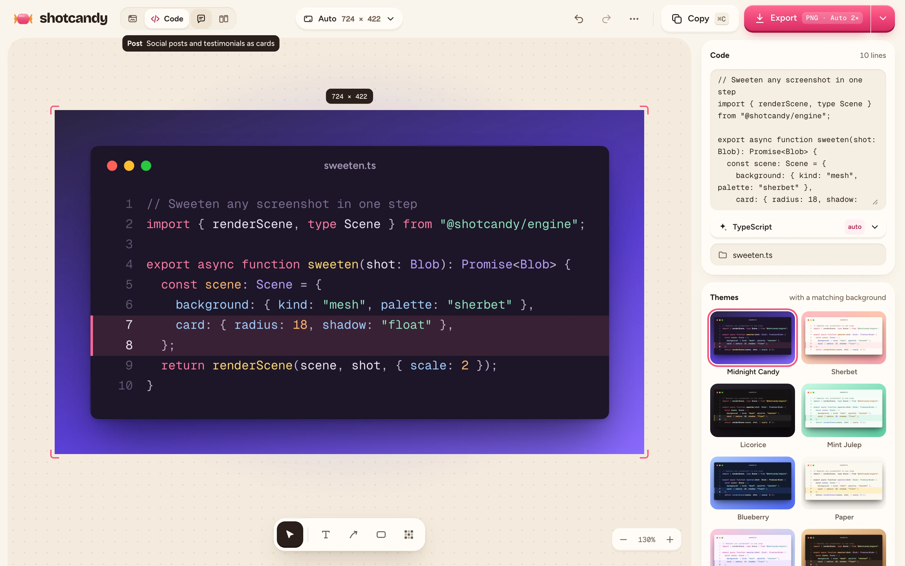
</picture>

### Post and testimonial cards

Type or paste a post or a quote and get a polished card: name, handle, avatar, stats or star rating, in light, cream, candy, dark or midnight. No third-party API involved.

<picture>
  <source media="(prefers-color-scheme: dark)" srcset="docs/screenshots/editor-testimonial-dark.webp">
  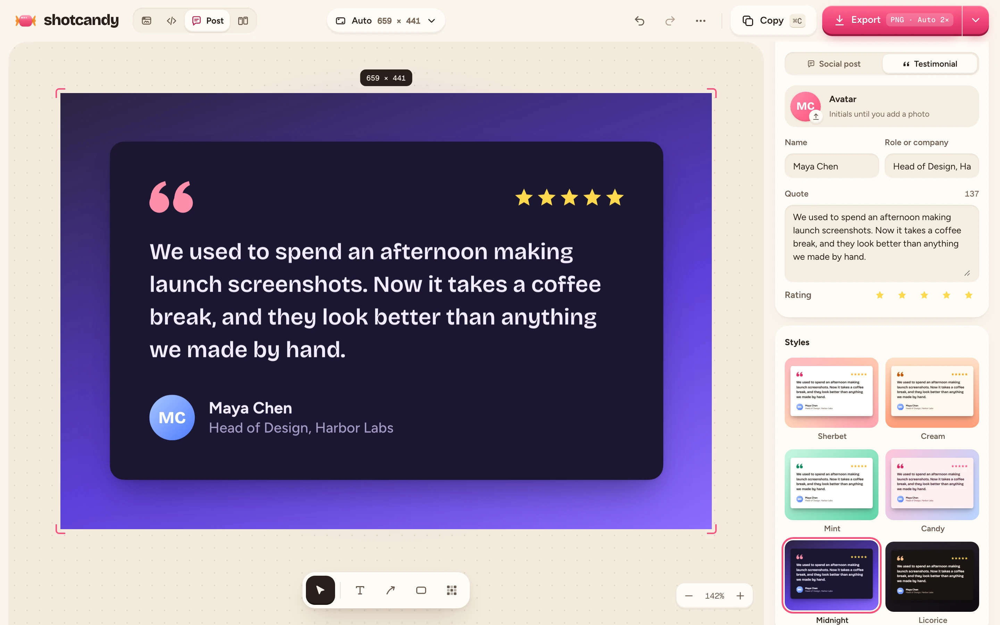
</picture>

### App Store sets

Build a 3 to 10 slide set with headlines at Apple's exact sizes (iPhone 6.9", 6.5", 6.3", 5.5" and iPad), restyle every slide at once, and export the whole set as a ZIP.

<picture>
  <source media="(prefers-color-scheme: dark)" srcset="docs/media/feature-appstore-dark.webp">
  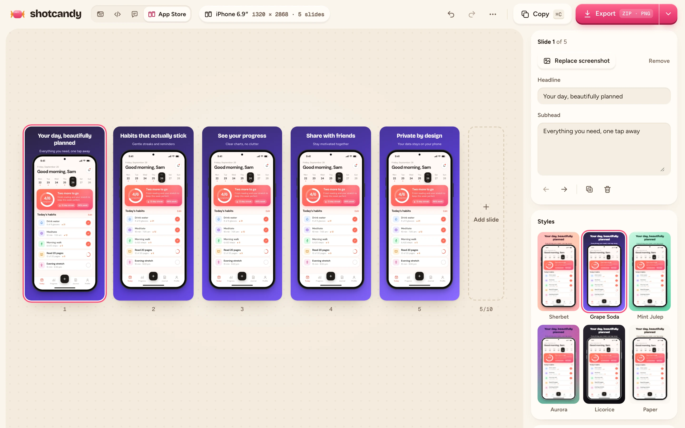
</picture>

### Export by destination

Tell Shotcandy where the image is going (X, LinkedIn, Instagram, Product Hunt, a README, Slack and docs) and it picks the size, format and quality, then checks the file fits that platform's limit. Or choose any preset yourself: Open Graph 1200×630, X, LinkedIn, Instagram post and story, Product Hunt, App Store and free aspect ratios. PNG, JPEG or WebP at 1× to 4×, copy to the clipboard, or download with your own filename pattern.

<picture>
  <source media="(prefers-color-scheme: dark)" srcset="docs/screenshots/editor-destinations-dark.webp">
  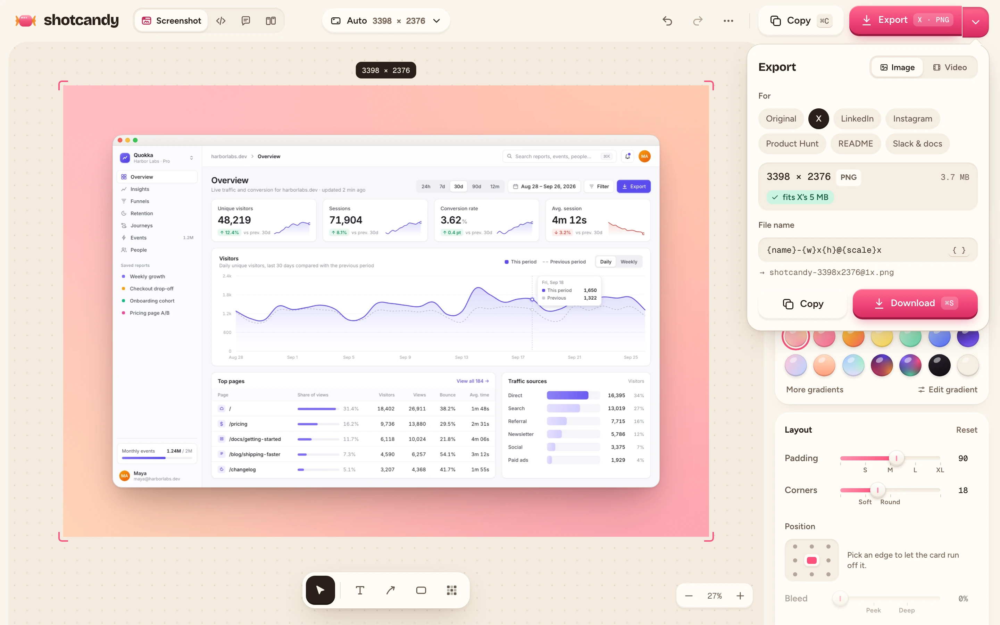
</picture>

### Keyboard shortcuts

Everything has a key. Press <kbd>?</kbd> in the app for the full sheet.

| Action | Keys |
| --- | --- |
| Paste a screenshot | <kbd>⌘</kbd> <kbd>V</kbd> |
| Copy the image | <kbd>⌘</kbd> <kbd>C</kbd> |
| Download / export options | <kbd>⌘</kbd> <kbd>S</kbd> / <kbd>⌘</kbd> <kbd>⇧</kbd> <kbd>S</kbd> |
| Candy Shuffle | <kbd>S</kbd> |
| Candy Jar (all styles) | <kbd>G</kbd> |
| Previous / next style | <kbd>[</kbd> <kbd>]</kbd> |
| Cycle frames / padding | <kbd>F</kbd> / <kbd>P</kbd> |
| Text, arrow, highlight, blur | <kbd>T</kbd> <kbd>A</kbd> <kbd>R</kbd> <kbd>B</kbd> |
| Play or pause motion | <kbd>M</kbd> |
| Size menu | <kbd>K</kbd> |

<picture>
  <source media="(prefers-color-scheme: dark)" srcset="docs/media/feature-shortcuts-dark.webp">
  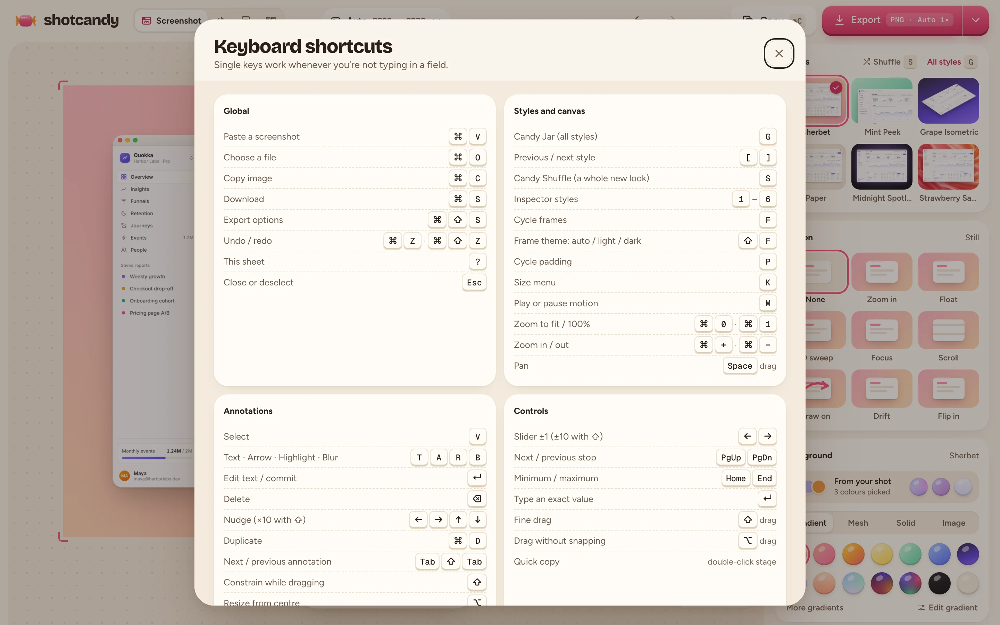
</picture>

## Privacy

Shotcandy is a static site. Your screenshots are decoded, rendered and encoded on your own device, in your browser, and are never uploaded anywhere. There are no accounts, no analytics and no server-side code. Recent designs, presets and uploaded backgrounds are kept in your browser's IndexedDB, and you can export any design as a `.shotcandy` project file to back it up or move it to another machine. After the page loads, the only network requests are for fonts.

## Run it locally

You need Node 20.9 or newer and pnpm.

```bash
pnpm i && pnpm dev
```

Then open http://localhost:3000.

## Self-host

Shotcandy is a static site, so you can host your own copy anywhere that serves files. The production build is plain files. There is nothing to configure: no environment variables, no database, no API routes.

```bash
pnpm build        # writes a fully static site to out/
pnpm serve        # optional: preview out/ with the zero-dependency static server
```

Upload `out/` to any static host: GitHub Pages, Netlify, Vercel, Cloudflare Pages, an S3 bucket or a plain nginx folder. URLs use trailing slashes, so no rewrite rules are needed.

## How it works

The heart of Shotcandy is a small, deterministic rendering engine in [`src/engine`](src/engine), written in plain TypeScript with no React dependency. The same scene plus the same input always produces the same pixels, which is what makes previews, exports and animation frames agree exactly.

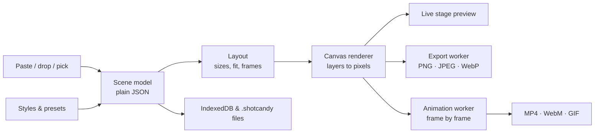
```mermaid
flowchart LR
  A[Paste / drop / pick] --> B[Scene model<br>plain JSON]
  P[Styles & presets] --> B
  B --> C[Layout<br>sizes, fit, frames]
  C --> D[Canvas renderer<br>layers to pixels]
  D --> E[Live stage preview]
  D --> F[Export worker<br>PNG · JPEG · WebP]
  D --> G[Animation worker<br>frame by frame]
  G --> H[MP4 · WebM · GIF]
  B --> I[IndexedDB & .shotcandy files]
```

- **Scene model** (`engine/scene`): a JSON description of canvas, background, card, frame, annotations and optional animation. Undo, presets, project files and the UI all read and write it.
- **Layout and render** (`engine/layout`, `engine/render`, `engine/frames`): layers drawn onto an HTML canvas, including our own vector frames and shadows.
- **Export** (`engine/export`): renders off the main thread in a worker, with size presets, scale factors and per-destination size limits.
- **Animation** (`engine/animation`): motion presets are functions of time over the same scene, encoded with WebCodecs plus `mp4-muxer` / `webm-muxer`, or `gifenc` for GIFs.
- **Screen recordings** (`engine/video`): a recording is a screenshot whose pixels change over time. Each output frame is the normal renderer drawing the scene with the recording's frame in place of the screenshot. [Mediabunny](https://mediabunny.dev) reads the file, decodes the trimmed clip at the output frame rate, and copies the sound across (or re-encodes it when the container needs to).
- **Batches** (`engine/batch`): a batch is one shared style plus each image's own changes. Export renders the images one at a time and streams them into a ZIP with [fflate](https://github.com/101arrowz/fflate), or writes them into a new Shotcandy folder inside one you pick.
- **Modes** (`engine/code`, `engine/post`, `engine/appstore`): code images, post cards and App Store sets build ordinary scenes, so they get every style, frame and export for free.
- **UI** (`src/components`, `src/state`): a Next.js static export with Tailwind. The editor store drives the engine; the engine never knows about React.

## Testing

```bash
pnpm test            # Vitest: engine unit tests and headless render tests
pnpm test:e2e        # Playwright: visual regression against committed baselines,
                     # export sizes, and app flows in Chromium, Firefox and WebKit
pnpm bench           # export performance (budget: a 4K export in under 1.5 s)
pnpm typecheck && pnpm lint
```

To see every style on every sample screenshot at once, render the contact sheet:

```bash
CONTACT=1 pnpm vitest run tests/render/contact-sheet.test.ts
```

## Contributing

Issues and pull requests are welcome. See [CONTRIBUTING.md](CONTRIBUTING.md) for the short version, [CHANGELOG.md](CHANGELOG.md) for what changed, and [SECURITY.md](SECURITY.md) to report a security problem.

- Keep the engine pure: no DOM or React imports in `src/engine`, and no clocks or unseeded randomness in anything that renders.
- Add tests alongside changes. Visual changes should update the Playwright baselines on purpose (`pnpm test:e2e:update`) and say so in the PR.
- Use the fictional samples in [`brand/samples`](brand/samples) for demos and tests. Please don't add real product screenshots, logos or vendor device art.
- Run `pnpm typecheck && pnpm lint && pnpm test` before opening a PR.

## Credits

- Fonts: [Bricolage Grotesque](https://github.com/ateliertriay/bricolage), [Figtree](https://github.com/erikdkennedy/figtree) and [Geist Mono](https://github.com/vercel/geist-font), all under the SIL Open Font License 1.1, bundled via [Fontsource](https://fontsource.org).
- [Shiki](https://shiki.style) (MIT) for syntax highlighting.
- [Mediabunny](https://github.com/Vanilagy/mediabunny) (MPL-2.0, used unmodified) for reading and converting screen recordings.
- [mp4-muxer](https://github.com/Vanilagy/mp4-muxer) and [webm-muxer](https://github.com/Vanilagy/webm-muxer) (MIT), [gifenc](https://github.com/mattdesl/gifenc) (MIT), [fflate](https://github.com/101arrowz/fflate) (MIT) and [idb](https://github.com/jakearchibald/idb) (ISC).
- Built with [Next.js](https://nextjs.org), [React](https://react.dev) and [Tailwind CSS](https://tailwindcss.com) (all MIT).
- The logo, wallpapers, frames, sample screenshots and launch media are original work, released under this project's MIT license. The sample apps and people in them are made up.

## Support

Shotcandy is free and always will be. If it saves you time, you can [support the project](https://shotcandy.app/support/) with a one-off tip or a small monthly contribution.

## License

[MIT](LICENSE) © 2026 Bilal Tahir

---

<p align="center"><a href="https://shotcandy.app"><b>Try it at shotcandy.app</b></a>, no sign-up needed.</p>
